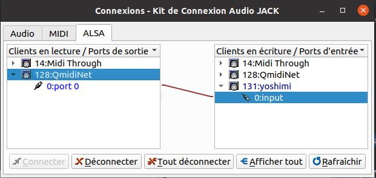

# QmidiNet

> give a try to the thing

Could be an alternative to midirtp / midirtpd
Can not run on web applications... because of security issues... so interrest is limited ... or you  need to attach a touchscreen to your main PC

- `npm install`
- launch QmidiNet `qmidinet` (if not installed install it ie `apt install qmidinet`)
- lauch QjackCtl & connect  QmidiNet out to any midi input

- lauch this app `npm start`
- click the "send note on" button -> the midi note should be send to the midi input
- click the "send note off" button -> the sound should stop playing